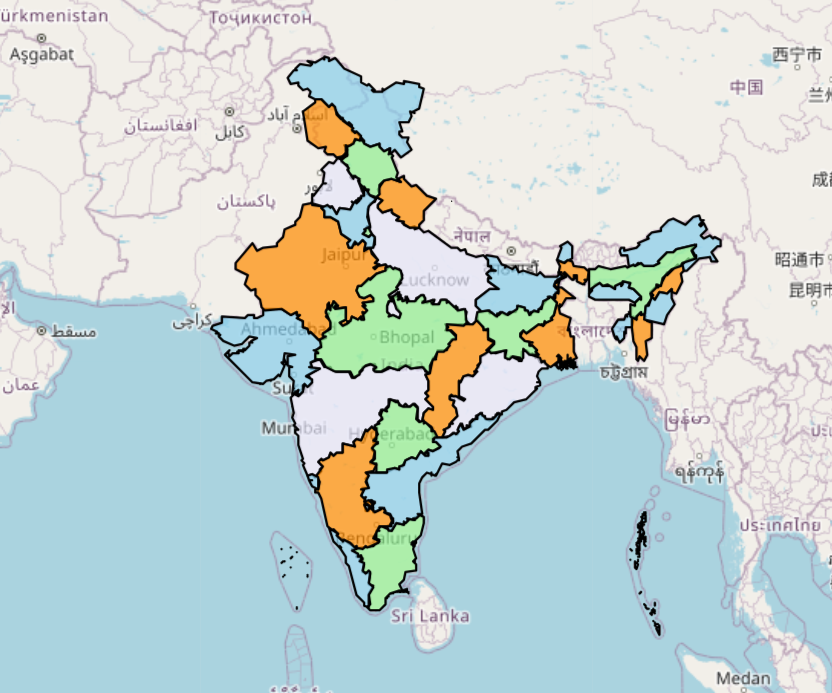

# Color Map of India - CSP Approach

This repository contains a **Constraint Satisfaction Problem (CSP)** implementation for **coloring the states and union territories of India** on a map. The goal is to ensure that no two adjacent regions share the same color, similar to the **Graph Coloring Problem**.

## Features

- Implements a **CSP-based approach** to assign colors while maintaining constraints.
- Uses **GeoPandas, Matplotlib, and Shapely** for spatial data processing and visualization.

## Colored Map of India 

  

## Reference

[GeeksforGeeks](https://www.geeksforgeeks.org/constraint-satisfaction-problems-csp-in-artificial-intelligence/)